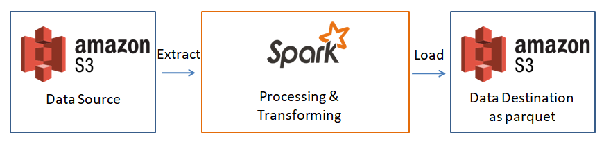
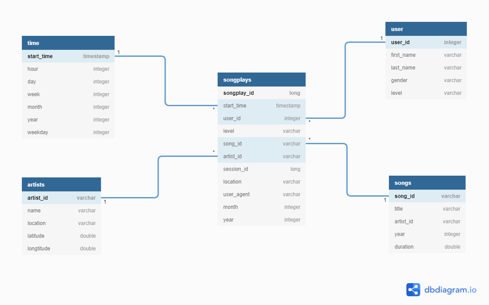

## Data Lake with Spark
- A music streaming startup, Sparkify, has grown their user base and song database even more and want to move their data warehouse to a data lake.

- This project will build an ETL pipeline that extracts data from AWS S3, processes the data to transform as star schema with Spark then loads the processed data back into s3 as parquet format. Data analysts can further extract insights into what they are interested in.

## Architecture

## Requirements
- Create Spark instance locally or AWS EMR.
- Install jupyter notebook if you are using local Spark. (AWS EMR will prepare it for you.)
- Confirm that you have `pyspark` module installed with your Python3.
- Prepare AWS_ACCESS_KEY & AWS_SECRET_ACCESS_KEY to access AWS S3.

## Dataset
### Song dataset
- The dataset is a subset of real data from the [Million Song Dataset](http://millionsongdataset.com/). Each file is in JSON format and contains metadata about a song and the artist of that song.

- Example: `{"num_songs": 1, "artist_id": "ARJIE2Y1187B994AB7", "artist_latitude": null, "artist_longitude": null, "artist_location": "", "artist_name": "Line Renaud", "song_id": "SOUPIRU12A6D4FA1E1", "title": "Der Kleine Dompfaff", "duration": 152.92036, "year": 0}`
    
### User activity dataset  
- The second dataset consists of log files in JSON format generated by the event simulator based on the songs in the dataset above. These simulate app activity logs from an imaginary music streaming app based on configuration settings.

- 

## Database Schema
Use star-schema for analytic purpose.
Include five tables, one fact table, `songplays` and four dimensional tables  `songs`, `artists`, `user` and `time`. 

## File Descriptions
### etl.py
This script will perform 3 steps in order. 
1. Pulls the song and log data from the s3 buckect.
2. Process those data into one fact table and four dimensional tables. 
3. Push the data into another s3 buckect as Spark parquet format. 

### dl.cfg
This .cfg contains the AWS keys.
- Set your AWS access and secret key to be able interact with AWS, these configs allow us access to AWS resources, should keep it private.

    - AWS_ACCESS_KEY_ID = {YOUR ACCESS KEY}
    - AWS_SECRET_ACCESS_KEY = {YOUR SECRET ACCESS KEY}

## Run command
- run the script to process song and log dataset:
`python etl.py`

